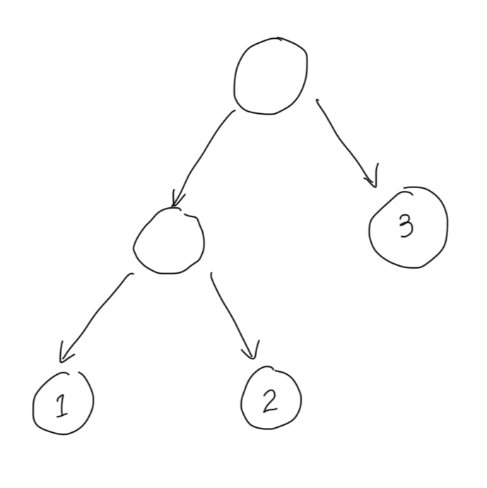

# Programming 2 - Exercise 3: Pattern Matching

This exercise set is intended to help you practice pattern matching.

As in the every exercise you need to obtain the exercise files. Clone or fork the repository: `git clone https://github.com/ur-tcs/programming-2-ex-3.git` or download it by clicking on the green `<code>` button and select `download`.

__Your are allowed to copy/clone/fork this repository, but not to share solutions of the exercise in any public repository or web page.__

## Introduction

In previous exercises, we used `if` conditionals and `.` field accessors to write functions on data types such as lists or trees. This week, we’ll use pattern matching to make these functions more succinct and readable. We’ll move from this:

```scala
def reduceIf(f: (Int, Int) => Int)(l: IntList): Int =
  if l.isEmpty then throw IllegalArgumentException("Empty list!")
  else if l.tail.isEmpty then l.head
  else f(l.head, reduceIf(f)(l.tail))
```

to this:

```scala
def reduceMatch(f: (Int, Int) => Int)(l: IntList): Int =
  l match
    case IntNil              => throw IllegalArgumentException("Empty list!")
    case IntCons(hd, IntNil) => hd
    case IntCons(hd, tl)     => f(hd, reduceMatch(f)(tl))
```

Most functional programmers find the second one much more readable, because it aligns the way the data is *destructed* (taken apart into a head and a tail) and the way the data is *constructed* (assembled from a head and a tail):

**Note:** in this function, the `f` is a higher-order argument. We will discuss them in detail in week 5.

```scala
def constructDestruct =
  IntCons(1, IntCons(2, IntNil)) match
    case IntCons(a, IntCons(b, IntNil)) =>
      println(f"Found $a and $b")
    case _ => throw Exception("Not possible!")
```

**Warning:** Previously, we wrote `IntNil()` for empty `IntList`s. Now that we know about `enum`s and case classes, we can use the more succinct and convenient syntax `IntNil` (no parentheses).

**Hint:** If you find yourself looking for more examples of pattern matching after completing this set, consider revisiting week 1 and week 2 exercises and redefining all the functions with pattern matching.


## Weekdays (Weekday.scala & WeekdayOps.scala)

Days of the week are a great example of simple enumerations. So, which day is tomorrow? let’s implement a function to find out.

The `enum` representing weekdays is defined as follows:

```scala
enum Weekday:
  case Monday
  case Tuesday
  case Wednesday
  case Thursday
  case Friday
  case Saturday
  case Sunday
```

Complete the following two functions:

1. `next` returns the next day of the week:
   ```scala
   def next(d: Weekday): Weekday =
     ???
   ```
2. `prev` returns the previous day of the week:
   ```scala
   def prev(d: Weekday): Weekday =
     ???
   ```

**Hint:** Want to test your code? Run `testOnly WeekdayOpsTest` in `sbt`.

**Note:** This exercise is taken from [Logical Foundations](https://softwarefoundations.cis.upenn.edu/lf-current/Basics.html), a book about mathematical proofs of programs, and translated into Scala.

## Tri-booleans (TriBool.scala & triBoolOps.scala)

By now you’re very familiar with Booleans. But in real life, not every thing is `Yes` or `No`: sometimes we just don’t know! Tri-boolean logic helps with this by adding an indeterminate value, `Maybe`:

```scala
enum TriBool:
  case Yes
  case No
  case Maybe
```

`Maybe` is like a Boolean value that is not yet known.

1. Take the time to think of how `Maybe` combine with `Yes` and `No`.

- If I have two objects, one which is for sure blue, and one that may be blue, then can I say that I have at least one blue item? Is that for sure or maybe? What does this entail about the “or” operator on tri-Booleans?

- If I have the same two objects (one blue, one maybe blue), can I conclusively say that not all or my objects are blue? Can I promise that they are all blue? What does this entail about the “and” operator on tri-Booleans?

2. Implement the following operations (we expect that you’ll find pattern-matching very nice for that!)

```scala
def neg(b: TriBool): TriBool =
  ???
```
```scala
def and(b1: TriBool, b2: TriBool): TriBool =
  ???
```
```scala
def or(b1: TriBool, b2: TriBool): TriBool =
  ???
```
```scala
def nand(b1: TriBool, b2: TriBool): TriBool =
  ???
```

**Hint 1:** For pattern-matching two values simultaneously, often the following style is used:

```scala
  (b1, b2) match
    case (Yes, Yes) => [...]
    case (Yes, No)  => [...]
```

An alternative is to use nested match-expressions.

**Hint 2:** Want to test your code? Run `testOnly TriBoolOpsTest` in `sbt`.

**Note:** `nand` is a very surprising operator. If you’re not familiar with it, inspect the test cases, or [read more about it!](https://en.wikipedia.org/wiki/Sheffer_stroke)

## Contexts (EnumContext.scala)

Now that you have a bit of experience with pattern matching, let’s use it to construct more complex types. In this exercise we’ll study *contexts*, which are essentially lists of keys and values. 

Our contexts associate names (`String`s) with values (`Int`s), and let us do the following:

- Create an empty context;
- Add an additional key/value pair (called a “binding”) to a context;
- Look up a key to retrieve the corresponding value;
- Remove a key and its corresponding value.

For instance, we can have a context which associates `"x"` with `1` and `"y"` with `2`. We can then look up the keys: looking up `"x"` in the context produces `1`, looking up `"y"` produces `2`, and looking up `"z"` or any other name results in a not-found error. We can add more mapping in the context: after associating `"z"` with `3`, looking `"z"` up in the new context will result in `3`, instead of an error.

Think of what Scala types and features you may use to represent a context before proceeding.

<details>
  <summary>Our choice of representation</summary>
    We’ll start by representing contexts using an enum (and we’ll see another representation later):

    
    enum Context:
      case Empty
      case Cons(name: String, value: Int, tail: Context)
    
    
  We have two cases:
  - `Empty`, which represents an empty context;
  - `Cons`, which forms a new context by associating a new name with its value in an existing context.

  For example, the context that associates `"x"` with `1` and `"y"` with `2` can be represented as `Cons("x", 1, Cons("y", 2, Empty))`, or `Cons("y", 2, Cons("x", 1, Empty))`.
  
</details>

**Note:** If you want to experiment with contexts in the playground, make sure to add `import EnumContext.*` to bring `Cons` and `Empty` into the worksheet’s scope.

**Warning:** When multiple bindings in a context have the same name, only the outermost is effective. For instance, given a context `Cons("a", 1, Cons("b", 2, Cons("a", 3, Empty)))`, looking up `"a"` this context should return `1` instead of `3`.

Implement the following three functions:

- `empty` returns an empty context:
  ```scala
  def empty: Context =
    ???
  ```
- `cons` forms a new context by associating a new pair of name-value in an existing context:
  ```scala
  def cons(name: String, value: Int, rem: Context) =
    ???
  ```
- `lookup` looks a name up in a given context:
  ```scala
  def lookup(ctx: Context, name: String): LookupResult =
    ???
  ```

  Notice the return type: we used another `enum`, called `LookupResult`, to capture two possible results: either finding a value, or indicating that the name could not be found.
  ```scala
  enum LookupResult:
    case Ok(v: Int)
    case NotFound
  ```
  
- `erase` drops **all** bindings with the given name in the context:
  ```scala
  def erase(ctx: Context, name: String): Context =
    ???
  ```

**Hint:** Want to test your code? Run `testOnly EnumContextTest` in `sbt`.

## Tree Mapping

Last week we worked with trees using a clunky API of `.left`, `.right`, and `.isEmpty`. This time, let’s do it the right way. And, to mix things up a bit, we’ll see a tree that contains values only at the leaves, instead of in every node.

The `IntTree` `enum` is defined as the following:

```scala
enum IntTree:
  case Leaf(value: Int)
  case Branch(left: IntTree, right: IntTree)
```

What might be the `enum` representation of the tree below?

<details>
  <summary>Solution</summary>
    Branch(Branch(Leaf(1), Leaf(2)), Leaf(3))
</details>



You will learn more about trees later in the course.

## IntList (IntList.scala & IntListOps.scala)

Let’s implement functions on `IntList` again, this time with pattern matching.

### polishEval

First, rewrite `polishEval` (from last week) with pattern-matching:

  ```scala
  def polishEval(l: IntList): (Int, IntList) =
    ???
  ```

Throw `InvalidOperationNumber exception` if the operator is not defined, and `InvalidExpression` if the input is not a valid polish-notation expression.

Compare your version new version with the original `if`-based implementation. Which one is more readable?

### extractSecond

Enumerations and case classes are often useful to distinguish multiple kinds of results. In an imperative language this would often be done with an exception: a function returns a result, and may throw various exceptions if the result cannot be computed. In Scala (and functional programming), we tend to use case classes instead, with one case per kind of result.

For example, a function that extracts the second element of a list might return a type like the following:

```scala
enum ExtractResult:
  case SecondElem(i: Int)
  case NotLongEnough
  case EmptyList
```

When the input list is empty, `extractSecond` returns `EmptyList`; when the input list is not long enough to have a second element (i.e. it only has one element), `extractSecond` returns `NotLongEnough`; finally, when the input list has a second element, the function returns it.

Implement `extractSecond`:

  ```scala
  def extractSecond(l: IntList): ExtractResult =
    ???
  ```
